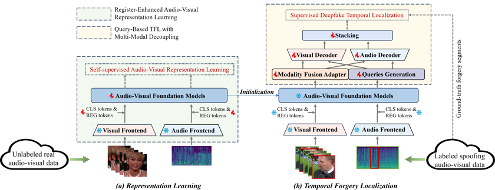

# RegQAV
This is the official repository for our MM 2025 paper "Query-Based Audio-Visual Temporal Forgery Localization with Register-Enhanced Representation Learning".
We are currently releasing a portion of the code, as this work is being further extended for a journal submission. The complete code and pretrained weights will be made available once the journal submission process is finalized.



## To-DO List

<div style="border: 2px solid #4CAF50; border-radius: 8px; padding: 10px; margin: 10px 0;">
  ✅ Release the main code of the model
</div>

<div style="border: 2px solid #2196F3; border-radius: 8px; padding: 10px; margin: 10px 0;">
  🔹 Release the model training code
</div>

<div style="border: 2px solid #2196F3; border-radius: 8px; padding: 10px; margin: 10px 0;">
  🔹 Release the model weights
</div>

## Citing

Please cite our paper if you find this repository useful.

```
@inproceedings{zhu2025query,
  author    = {Xiaodong Zhu and Suting Wang and Junqi Yang and Yuhong Yang and Weiping Tu and Zhongyuan Wang},
  title     = {Query-Based Audio-Visual Temporal Forgery Localization with Register-Enhanced Representation Learning},
  booktitle = {Proceedings of the 33rd ACM International Conference on Multimedia (MM '25)},
  year      = {2025},
  pages     = {1--10},
  address   = {Dublin, Ireland},
  publisher = {ACM},
  doi       = {10.1145/3746027.3755563}
}
```
