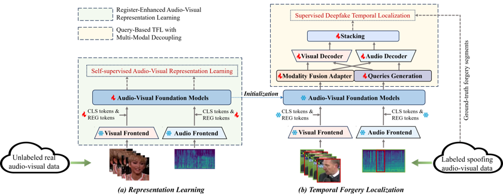

# RegQAV
This is the official repository for our MM 2025 paper "Query-Based Audio-Visual Temporal Forgery Localization with Register-Enhanced Representation Learning".
We are currently releasing a portion of the code, as this work is being further extended for a journal submission. The complete code and pretrained weights will be made available once the journal submission process is finalized.



## Inference Guide

Follow these steps to run inference using the pre-trained models.

### Step 1: Install Dependencies

First, ensure you have all the required libraries installed. Run the following command in your terminal:

```bash
pip install -r requirements.txt
```

### Step 2: Download the Dataset
Download one of the supported datasets to your local machine:
* **LAV-DF**
* **AV-Deepfake1M**

### Step 3: Download Pretrained Checkpoints
Download the pretrained weights/checkpoints from Google Drive to your local machine:
* [Google Drive Download Link](YOUR_GOOGLE_DRIVE_URL_HERE)

After downloading, place the checkpoint file into your project directory (e.g., `Reg-QAV/checkpoints/`).

### Step 4: Configure Dataset Paths
Depending on the dataset you downloaded, open the corresponding configuration file and modify the `data_root` field to point to your local dataset directory.

* For **LAV-DF**, modify `Reg-QAV/config/datasets/lavdf.yaml`:
    ```yaml
    data_root: "/path/to/your/local/lavdf"
    ```
* For **AV-Deepfake1M**, modify `Reg-QAV/config/datasets/avdeepfake1m.yaml`:
    ```yaml
    data_root: "/path/to/your/local/avdeepfake1m"
    ```

### Step 5: Run Inference
Since the datasets are typically large, you need to configure multi-device processing, specify the checkpoint path, and set the output location before running the inference script.

1. Open `inference.py`.
2. Specify your target GPU/CPU IDs in the `devices` parameter.
3. Ensure the checkpoint path points to the file you downloaded in Step 3.
4. Specify the output directory in the `res_dir` parameter.
5. Execute the inference script:
   ```bash
   python inference.py
   ```

### Step 5: Combine Results

After the inference is complete, the results may be scattered across multiple files. You can merge them into a single, comprehensive result file.

1. Open combine.py.
2. Fill in the input_files list with the paths of your scattered inference result files.
3. Run the combination script:

```python
python combine.py
```

## To-DO List

<div style="border: 2px solid #4caf50; border-radius: 8px; padding: 10px; margin: 10px 0;">
  ✅ Release the main code of the model
</div>

<div style="border: 2px solid #2196F3; border-radius: 8px; padding: 10px; margin: 10px 0;">
  🔹 Release the model training code
</div>

<div style="border: 2px solid #4caf50; border-radius: 8px; padding: 10px; margin: 10px 0;">
  ✅ Release the model weights
</div>

## Citing

Please cite our paper if you find this repository useful.

```
@inproceedings{zhu2025query,
  author    = {Xiaodong Zhu and Suting Wang and Junqi Yang and Yuhong Yang and Weiping Tu and Zhongyuan Wang},
  title     = {Query-Based Audio-Visual Temporal Forgery Localization with Register-Enhanced Representation Learning},
  booktitle = {Proceedings of the 33rd ACM International Conference on Multimedia (MM '25)},
  year      = {2025},
  pages     = {1--10},
  address   = {Dublin, Ireland},
  publisher = {ACM},
  doi       = {10.1145/3746027.3755563}
}
```
